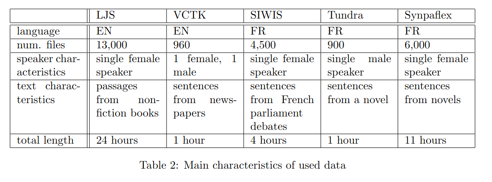

# Cross Lingual Speaker Adaptation for TTS Applications


## Software Project by team for the Software Project Course at University of Lorraine.
Members: 

# Abstract

This paper describes a multilingual TTS system for transferring of voice characteristics between speakers in French and English. We modify grad-TTS and experiment with four different model architectures. The results are evaluated both objectively with four metrics and subjectively using MOS for assessing speaker transformation and speech quality. We provide analysis of the results and discuss possible further directions of research. The system demo is available online on (link).

# Outline

1. [Directory Structure](#directory-structure)
2. [Introduction](#introduction)
3. [Installation](#installation)
4. [Execution](#execution)
5. [Dataset](#dataset)
6. [Contributing](#contributing)
7. [Licence](#licence)


## Directory structure

├── 2005.11129.pdf 
|
├── 2105.06337.pdf 
|
├── app.py 
|
├── documents 
|   |
│   └── presentation.pdf 
├── modules 
|   |
│   ├── datasets.py 
│   ├── phoeneme_dictionary_extraction.py 
│   └── preprocessing.py 
├── README.md 
|
└── templates 

    


## Introduction

In this project, we have introduced the implementation of grad-TTS: Diffusion Probabilistic Model for Text-to-Speech [reference] to generate the audio in particular language, for particular speaker. During inference, the model takes the language, text and speaker as inputs and produces the speech in the specified language, in the voice of the specified speaker. During the experiments, representations for language and speaker were varied and the performance of models are evaluated using both objective and subjective evaluation. Similarly, the text representation is done as phoneme units where we combined the phonemes for French and English language without overlapping. The representation of each phoneme is controlled by the language due to the highly similar alphabets with varying sounds for same alphabets. The main contribution of our work is as follow:


    - Multilingual Text-to-Speech representation for French and English language.
    - Speaker transformation across same or different languages.
    - Evaluating the effects of varying representations of language and speaker.
    - Evaluating the effects of adding speakers on the performance.


## Installation

Note: Since, the project it requires some memory space and RAM, Make sure you have around 3 GB physical disk space, 4 GB RAM and enough space to install the requirements. 

---

The Dockerfile **tts_app/Grad-docker** creates an image of the Grad-TTS system that is compatible that can be run on a GPU node.

- For Grid-5000 users, first install Docker on the node 

```
g5k-setup-nvidia-docker -t".
```

- Then build the image with:

```
"docker build ."
```

- Run a container with:

```
docker run -it [container] /bin/bash
```

- Download/transfer the model checkpoints to the container.

---

### Initial Downloads

To download the model checkpoint, go to the [Link](), put both of the model in the results/ folder.

************************************************************************************************************************************
**_YAY!!_** Installation is done! Now you can jump to the execution part and run the web app.


## Execution
**!!!** .

To run the webapp, run the following code, being in the root directory.

    python3 src/views.py

---


## Dataset

## Contributing
Pull requests are welcome. For major changes, please open an issue first to discuss what you would like to change.

Please make sure to update tests as appropriate.

## Licence
[MIT](https://choosealicense.com/licenses/mit/)
